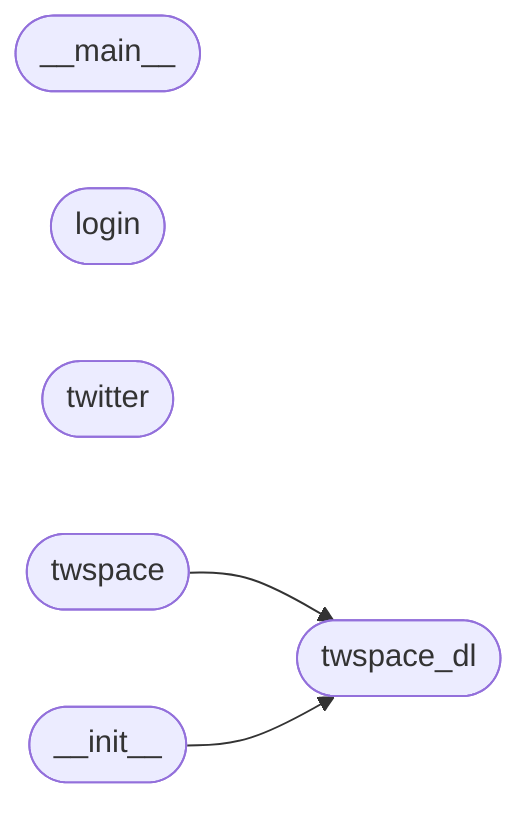

# Code Overview

[_Documentation generated by Documatic_](https://www.documatic.com)

<!---Documatic-section-Codebase Structure Python-start--->
## Codebase Structure Python

The codebase has a flat structure, with 6 code files.

<!---Documatic-block-system_architecture-start--->

<!---Documatic-block-system_architecture-end--->

# #
<!---Documatic-section-Codebase Structure Python-end--->

<!---Documatic-section-Important Functions-start--->
## Important Functions

<!---Documatic-block-important_funcs-start--->
<!---Documatic-block-most_used_funcs-start--->
### Most Utilised Functions

* twspace_dl.twspace_dl.twitter (2 times)
<!---Documatic-block-most_used_funcs-end--->

<!---Documatic-block-end_user_funcs-start--->
### End User Exposed Functions

* twspace-dl.__main__.exception_hook
* twspace-dl.__main__.space
* twspace-dl.__main__.main
<!---Documatic-block-end_user_funcs-end--->
<!---Documatic-block-important_funcs-end--->

# #
<!---Documatic-section-Important Functions-end--->

<!---Documatic-section-File IO-start--->
## File IO

<!---Documatic-block-file_io-start--->
The following files have file read operations

<!---Documatic-block-twspace_dl-start--->

	
<code>twspace_dl</code> (Click to Expand!)

* twspace_dl.login
* twspace_dl.twspace

<!---Documatic-block-twspace_dl-end--->

The following files have file write operations

<!---Documatic-block-twspace_dl-start--->

	
<code>twspace_dl</code> (Click to Expand!)

* twspace_dl.__main__
* twspace_dl.login
* twspace_dl.twspace_dl

<!---Documatic-block-twspace_dl-end--->
<!---Documatic-block-file_io-end--->

# #
<!---Documatic-section-File IO-end--->

<!---Documatic-section-Class Hierarchy-start--->
## Class Hierarchy

<!---Documatic-block-dict-start--->

	
<code>dict</code> (Click to Expand!)

* twspace_dl.twspace.Twspace

<!---Documatic-block-dict-end--->

# #
<!---Documatic-section-Class Hierarchy-end--->

[_Documentation generated by Documatic_](https://www.documatic.com)